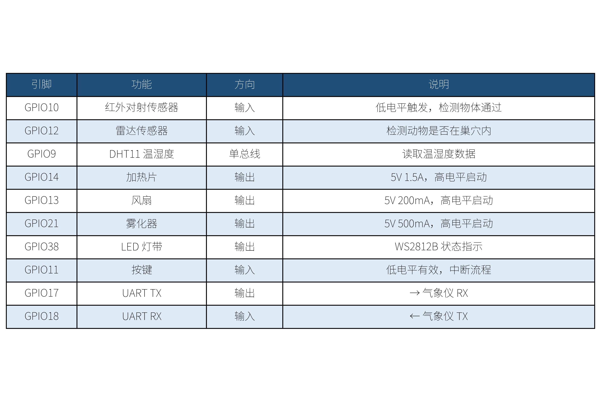

# OpenWild Agent — Version 2 (Standalone LLM)

**Requires separate image recognition API configuration. Higher recognition accuracy. For users with API experience.**

---

## How This Version Differs from Version 1

| Item | Version 2 (Standalone LLM) | Version 1 (Built-in) |
|:-----|:---------------------------|:--------------------|
| **Image Recognition** | Dedicated vision LLM API (GPT-4o Vision / Claude / Qwen-VL, etc.) | Built-in LLM, no extra config needed |
| **Recognition Model** | Customizable (choose strongest model) | Built-in model, not replaceable |
| **API Cost** | User pays for API usage | Zero cost |
| **Setup Difficulty** | Requires `cloud_vision.lua` configuration | Zero config |
| **Target Users** | Users with API experience | Beginners |

---

## Hardware Requirements

| Component | Model | Qty | Notes |
|:----------|:------|:----:|:------|
| Main Board | ESP32-S3-DevKitC | 1 | Core controller |
| Camera | OV2640 or USB UVC | 1 | Aimed at nest interior |
| DHT11 | Temp/humidity sensor | 1 | GPIO9 |
| IR Beam Sensor | Slot-type photoelectric | 1 | GPIO10, door trigger |
| HLK-LD112 Radar | Doppler radar | 1 | GPIO5, in-nest detection |
| Heating Film | 5V 1A | 1 | GPIO14, temperature control |
| Fan | 5V 200mA | 1 | GPIO13, temperature control |
| Humidifier | 5V 500mA | 1 | GPIO21, humidity control |
| OLED Screen | 2-inch SPI | 1 | I2C interface |
| DFRobot EDU0157 | Lark weather station | 1 | GPIO17/18, UART |
| 18650 Li-ion ×2 | 3.7V 6800mAh | 2 | Parallel power supply |
| Rain shield + custom bracket | Acrylic sheet | 1 | See docs/hardware-diy.md |
| Emergency drinker | Bird/pet waterer | 1 | See docs/hardware-diy.md |

---

## GPIO Pin Assignment

| GPIO | Function | Notes |
|:-----|:---------|:------|
| GPIO5 | HLK-LD112 radar signal | Doppler radar, in-nest animal detection |
| GPIO6 | OLED SCL | I2C clock |
| GPIO7 | OLED SDA | I2C data |
| GPIO9 | DHT11 data | Temp/humidity sensor |
| GPIO10 | IR beam sensor | Door trigger, active low |
| GPIO13 | Fan control | PWM speed control |
| GPIO14 | Heating film control | PWM speed control |
| GPIO17 | Weather station TX | UART transmit |
| GPIO18 | Weather station RX | UART receive |
| GPIO21 | Humidifier control | On/off switch |



---

## Directory Structure

```
version2-standalone/
├── README.md                # This file
├── config/                  # ★ ESP-Claw config directory (deployed to /fatfs/config/)
│   ├── animal_db.lua       # Animal database (2,067B)
│   └── animal_env.json     # Species environment config (written by yeshengdongwu17b at runtime)
├── data/                   # ★ JSONL data directory (deployed to /fatfs/data/)
│   ├── weather_log.jsonl    # Weather data log
│   ├── species_log.jsonl    # Species visit log
│   ├── system_log.jsonl    # System status log
│   └── learning_log.jsonl   # AGENT learning log
└── scripts/user/          # ★ Lua scripts directory (deployed to /fatfs/scripts/user/)
    ├── main.lua           # Weather station main (10,756B)
    ├── yeshengdongwu17b.lua # ★ Wildlife monitor main (17,807B, with cloud vision)
    ├── AI_blogger.lua     # AI blogger (27,464B)
    ├── cloud_vision.lua   # ★ Cloud vision wrapper (API required, 4,572B)
    ├── display.lua        # OLED display (2,594B)
    ├── incubator.lua      # Incubator mode (3,905B)
    ├── check.lua          # Storage diagnostics (6,975B)
    ├── cfg.md             # Field deployment parameter reference (not deployed to device)
    └── agent/            # ★ AGENT module directory
        ├── agent_memory.lua       # Memory module (6,501B)
        ├── agent_learning.lua     # Learning module (11,131B)
        ├── agent_chat.lua        # Chat module (5,662B)
        └── agent_self_monitor.lua # Monitor module (2,017B)
```

> **Note**: config/ and data/ are ESP-Claw root directories. Deploy to device `/fatfs/config/` and `/fatfs/data/` via `idf.py openocd` or `espowershell`.

---

## Software Module List (Version 2, 12 modules total)

| Category | Module | File Size | Version | Description |
|:---------|:-------|---------:|:-------:|:-----------|
| Main | `main.lua` | 10,756B | V17b | Weather station main, system state machine |
| Main | `yeshengdongwu17b.lua` | 17,807B | V17b | Wildlife monitor main, cloud vision integrated |
| AGENT | `agent_memory.lua` | 6,501B | V7.7 | Memory: 2-day weather retention + species records never cleared |
| AGENT | `agent_learning.lua` | 11,131B | V7.5 | Learning: 5 core question adaptation |
| AGENT | `agent_chat.lua` | 5,662B | V7.3 | Chat: 7 natural language query types |
| AGENT | `agent_self_monitor.lua` | 2,017B | V7.3 | Monitor: memory/WiFi alerts |
| Feature | `AI_blogger.lua` | 27,464B | v2.7.8 | AI blogger: Xiaohongshu-style post generation |
| Feature | `display.lua` | 2,594B | V17b | OLED status display |
| Feature | `incubator.lua` | 3,905B | V17b | Incubator mode: 37.5–38.5°C constant |
| Feature | `cloud_vision.lua` | 4,572B | V17b | Cloud vision (standalone config, requires API Key) |
| Feature | `check.lua` | 6,975B | v4 | Storage diagnostics: startup cleanup /photos/ + /blog/ |
| Ref | `cfg.md` | 920B | — | Field deployment 4-parameter checklist (not deployed to device) |

---

## Module Dependencies

### Call Matrix (✓ = calls)

| Caller ↓ / Callee → | main | 17b | mem | lrn | chat | mon | blog | disp | inc | cv | check |
|:---|:---:|:---:|:---:|:---:|:---:|:---:|:---:|:---:|:---:|:---:|:---:|
| **main.lua** | — | dofile | ✓ | ✓ | ✓ | ✓ | ✓ | ✓ | ✓ | ✓ | startup |
| **yeshengdongwu17b.lua** | | — | ✓ | ✓ | | ✓ | ✓ | ✓ | ✓ | dofile | |
| **agent_memory.lua** | | | — | | ✓ | | | | | | |
| **agent_learning.lua** | | ✓ | | — | | | | | | | |
| **agent_chat.lua** | | ✓ | ✓ | | — | | | | | | |
| **agent_self_monitor.lua** | | ✓ | | | | — | | | | | ✓ |
| **AI_blogger.lua** | | ✓ | ✓ | | | | — | ✓ | | ✓ | |
| **cloud_vision.lua** | | dofile | | | | | | | | — | |

### Four Key Call Chains

```
① System Boot Chain
   main → agent_memory → display (splash) → main loop

② IR Trigger Chain (GPIO10 == 0)
   main → yeshengdongwu17b (dofile) → cloud_vision → mem.logSpecies → Feishu push → return to main

③ AGENT Query Chain (Feishu message)
   Feishu → main → agent_chat → agent_memory / agent_learning (query) → chat push

④ AI Blogger Chain (every 4 hours post-trigger)
   agent_memory → AI_blogger → cloud_vision → Feishu push
```

---

## Cloud Vision Configuration (cloud_vision.lua)

The key difference of Version 2 is that `cloud_vision.lua` is a standalone config file that requires your API key and endpoint.

**Supported Vision LLM APIs:**

| Provider | Model | Endpoint Example |
|:---------|:------|:----------------|
| OpenAI | GPT-4o Vision | `https://api.openai.com/v1/chat/completions` |
| Claude (Anthropic) | Claude 3.5 Sonnet | `https://api.anthropic.com/v1/messages` |
| Alibaba Cloud | Qwen-VL2 | `https://dashscope.aliyuncs.com/compatible-mode/v1/chat/completions` |
| SiliconFlow | Llama-3.2-Vision | `https://api.siliconflow.cn/v1/chat/completions` |
| Self-hosted | Any OpenAI-compatible | Enter your server address |

**Configuration:**

Open `scripts/user/cloud_vision.lua` and fill in your values:

```lua
-- ============================================================
-- API Configuration (must fill in, otherwise cloud vision won't work)
-- ============================================================
local CFG = {
    provider   = "openai",      -- options: openai / claude / qwen / siliconflow / custom
    api_key    = "sk-xxx...xxx", -- ★ Replace with your API key
    model      = "gpt-4o",      -- or "claude-3-5-sonnet-20241014" etc.
    endpoint   = nil,            -- Usually auto-detected, can fill in manually
    max_tokens = 512,
    timeout_ms = 30000,
}
```

> **Security Note**: API keys are sensitive. Before committing to GitHub, make sure the key in `cloud_vision.lua` is replaced with a placeholder. This repository ships with placeholder `sk-xxx...xxx`. Replace with your actual key.

---

## Feishu Configuration

Version 2 uses Feishu message push. Configure the following in ESP-IDF menuconfig:

```
Component config → Feishu Message
├── FEISHU_APP_ID          # Feishu app App ID
├── FEISHU_APP_SECRET      # Feishu app App Secret
├── FEISHU_BOT_NAME        # Bot name (optional)
└── FEISHU_ALLOW_USER_IDS   # Comma-separated allowed user IDs
```

**Steps to create a Feishu bot:**

1. Open [Feishu Open Platform](https://open.feishu.cn/app) and create an enterprise self-built app
2. Get `App ID` and `App Secret` from "Credentials & Basic Info"
3. Enable bot capability in "App Features → Bot"
4. In "Permissions Management", add: `im:message:send_as_bot` (send messages)
5. After publishing, fill `App ID` and `App Secret` into menuconfig
6. Add the bot to your target group to receive pushes

> Feishu user IDs in this file have been replaced with placeholder `ou_XXXXXXXXXXXXXXXXXXXXXXXX`. Replace with your actual IDs.

---

## Data Storage

Runtime-generated data files (at `/fatfs/data/`):

| File | Content | Retention Policy |
|:-----|:--------|:----------------|
| `weather_log.jsonl` | Weather data (temp/humidity/wind speed/pressure, etc.) | 2 days by date |
| `species_log.jsonl` | Species visit records (time/species/environment) | Never auto-cleared (research value) |
| `system_log.jsonl` | System status (memory/WiFi/uptime) | 1 record/hour |
| `learning_log.jsonl` | AGENT learning results (threshold adjustments/analysis) | 1 record/day |

---

## PSRAM Fragmentation: Problem and Solution

Version 2 is based on `yeshengdongwu17b.lua`, which includes a complete PSRAM fragmentation solution (17 GC insertions + 4-stage defense), ensuring 10 consecutive triggers without crash.

**Symptom:** After 3–5 consecutive IR triggers, `camera.open()` returns false and photography fails completely.

**Root Cause:** Under consecutive triggers, PSRAM becomes severely fragmented: DHT bit sampling, radar/GPIO checks, Feishu JSON parsing, knowledge base traversal — all these Lua allocations slice PSRAM into fragments, causing DMA buffer allocation failures.

**Solution:**
```lua
-- 1. closeCameraHard(): multiple closes + 800ms wait + 2× collectgarbage
-- 2. cap() 4-stage defense: close → retry → drop frame → capture
-- 3. 17 collectgarbage insertions (6 in main + 11 in AI blogger)
-- 4. cleanupBeforeReturn(): forced cleanup before exit
```

---

## FAQ

**Q: Still can't recognize after configuring cloud_vision.lua?**
A: Check if API key is correct and endpoint is reachable. Test the API with curl first.

**Q: Recognition latency too high?**
A: Cloud vision latency depends on API provider speed. Try a faster model in `cloud_vision.lua`.

**Q: camera.open fails after consecutive triggers?**
A: This is PSRAM fragmentation. V17b has completely solved it via 17 GC insertions + 4-stage defense. If it still happens, verify you are using the correct version.

**Q: No Feishu messages received?**
A: Confirm App ID and App Secret are correct in `menuconfig`, and the Feishu bot has been added to the target group.

---

## DIY Hardware

For DIY instructions on rain shields, rainwater collectors, spray guide channels, and emergency drinkers, see `docs/hardware-diy.md`.

---

## License

Apache License 2.0 — see project root `LICENSE`.
